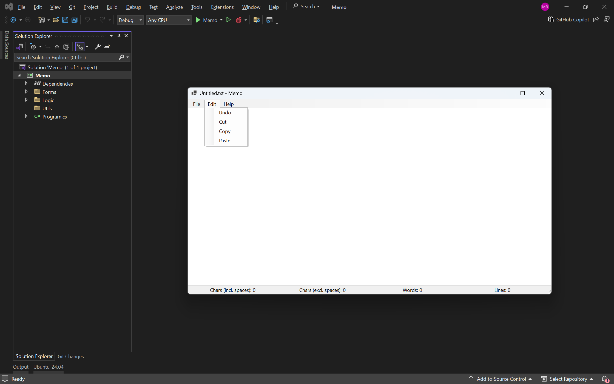

# Memo - Simple Notepad Windows App


**Memo** is a lightweight, user-friendly notepad application built with **C#** and **Windows Forms**. 
It provides essential text editing features in a clean, minimal interface—perfect for quick notes, ideas, or drafts.

---

## Features

- **Basic Text Editing**  
  - Type, edit, and format plain text  
  - Undo, Cut, Copy, Paste (via right-click context menu)




- **Real-time Statistics**  
  - Characters (including spaces)  
  - Characters (excluding spaces)  
  - Words  
  - Lines  

- **Clean & Responsive UI**  
  Built with Windows Forms for native performance and familiarity.

## Technologies Used

- **Language**: C# (.NET Framework / .NET Core)
- **UI Framework**: Windows Forms (WinForms)
- **IDE**: Visual Studio 2022 (or later)
- **Target OS**: Windows 10/11

## How to Build & Run

1. **Clone or Open the Project**
   ```bash
   git clone https://github.com/mustafahrahimi/Memo.git

2. Open Memo.sln

3. Press Ctrl+Shift+B or go to Build > Build Solution

4. Press F5 or click Start
